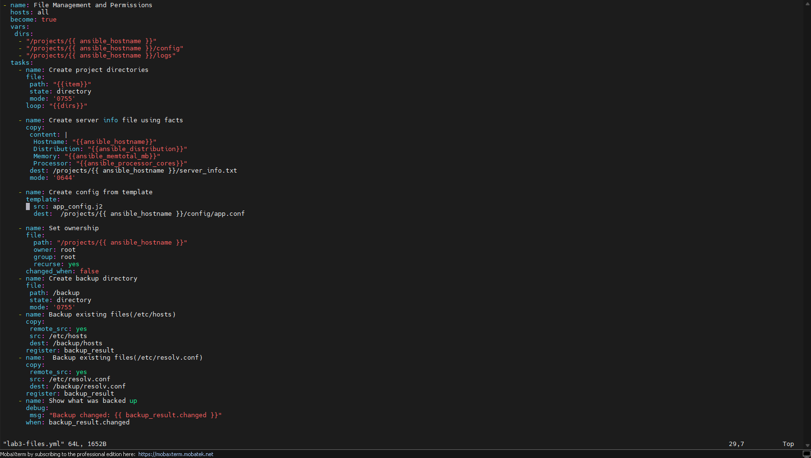
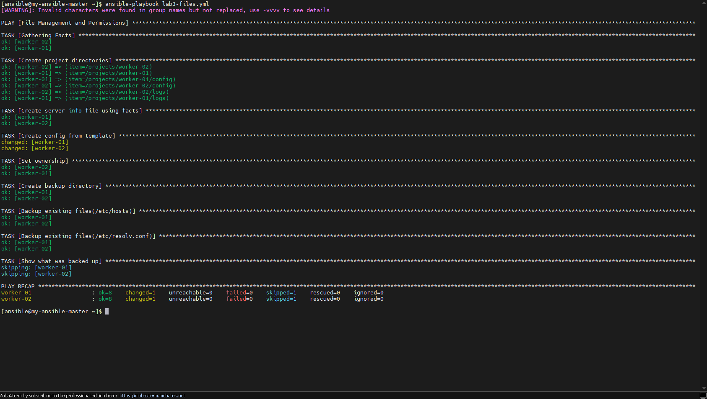
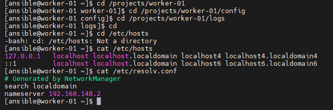

# Ansible Fact-Driven Server Provisioning

An Ansible playbook that builds a per-host project directory structure, writes a server info file and a config file using **gathered facts**, sets ownership, and backs up key system files with `register`/`changed_when` logic — a DEPI DevOps Track task.

**Concepts used:** `facts`, `templating`, `changed_when`, `register`

---

## 📋 Task Overview

Create a playbook called `lab3-files.yml` that performs the following:

**Task 1 — Create project directories**
- Module: `file`
- Parameters: `path`, `state: directory`, `mode: '0755'`
- Creates:
  - `/projects/{{ ansible_hostname }}`
  - `/projects/{{ ansible_hostname }}/config`
  - `/projects/{{ ansible_hostname }}/logs`
- Uses a `loop` with a variables list (`dirs`)

**Task 2 — Create server info file using facts**
- Module: `copy`
- Parameters: `content`, `dest`, `mode: '0644'`
- Creates `/projects/{{ ansible_hostname }}/server_info.txt`
- Content pulls from gathered facts: `ansible_hostname`, `ansible_distribution`, `ansible_memtotal_mb`, `ansible_processor_cores`

**Task 3 — Create config from template**
- Template file: `app_config.j2`
- Module: `template`
- Parameters: `src: app_config.j2`, `dest: /projects/{{ ansible_hostname }}/config/app.conf`

**Task 4 — Set ownership**
- Module: `file`
- Parameters: `path: /projects/{{ ansible_hostname }}`, `owner: root`, `group: root`, `recurse: yes`
- Uses `changed_when: false` since ownership may already be correct

**Task 5 — Backup existing files**
- Module: `copy`
- Parameters: `remote_src: yes`, `src`, `dest`
- Backs up `/etc/hosts` and `/etc/resolv.conf` to `/backup`
- Registers the result in `backup_result`

**Task 6 — Show what was backed up**
- Module: `debug`
- Shows `backup_result.changed`
- Only runs `when: backup_result.changed` is true

**Variables defined:**
```yaml
dirs:
  - "/projects/{{ ansible_hostname }}"
  - "/projects/{{ ansible_hostname }}/config"
  - "/projects/{{ ansible_hostname }}/logs"
```

---

## 📜 Playbook Code — `lab3-files.yml`



```yaml
- name: File Management and Permissions
  hosts: all
  become: true
  vars:
    dirs:
      - "/projects/{{ ansible_hostname }}"
      - "/projects/{{ ansible_hostname }}/config"
      - "/projects/{{ ansible_hostname }}/logs"

  tasks:
    - name: Create project directories
      file:
        path: "{{item}}"
        state: directory
        mode: '0755'
      loop: "{{dirs}}"

    - name: Create server info file using facts
      copy:
        content: |
          Hostname: {{ansible_hostname}}
          Distribution: {{ansible_distribution}}
          Memory: {{ansible_memtotal_mb}}
          Processor: {{ansible_processor_cores}}
        dest: /projects/{{ ansible_hostname }}/server_info.txt
        mode: '0644'

    - name: Create config from template
      template:
        src: app_config.j2
        dest: /projects/{{ ansible_hostname }}/config/app.conf

    - name: Set ownership
      file:
        path: "/projects/{{ ansible_hostname }}"
        owner: root
        group: root
        recurse: yes
      changed_when: false

    - name: Create backup directory
      file:
        path: /backup
        state: directory
        mode: '0755'

    - name: Backup existing files(/etc/hosts)
      copy:
        remote_src: yes
        src: /etc/hosts
        dest: /backup/hosts
      register: backup_result

    - name:  Backup existing files(/etc/resolv.conf)
      copy:
        remote_src: yes
        src: /etc/resolv.conf
        dest: /backup/resolv.conf
      register: backup_result

    - name: Show what was backed up
      debug:
        msg: "Backup changed: {{ backup_result.changed }}"
      when: backup_result.changed
```

---

## 📄 Template — `app_config.j2`

```jinja2
# App Configuration
server_name: {{ ansible_hostname }}
memory_mb: {{ ansible_memtotal_mb }}
cpu_cores: {{ ansible_processor_cores }}
created: {{ ansible_date_time.iso8601 }}
```

---

## ▶️ Running the Playbook

```bash
ansible-playbook lab3-files.yml
```



Each task runs across both workers (`worker-01`, `worker-02`):

- `Gathering Facts` — ok on both hosts
- `Create project directories` — ok for all three directories on both hosts
- `Create server info file using facts` — ok on both hosts
- `Create config from template` — **changed** on both hosts (new file rendered from the template)
- `Set ownership` — ok on both hosts (`changed_when: false` keeps this from reporting a change)
- `Create backup directory` — ok on both hosts
- `Backup existing files(/etc/hosts)` — ok on both hosts
- `Backup existing files(/etc/resolv.conf)` — ok on both hosts
- `Show what was backed up` — **skipping** on both hosts, since the backup files already existed with identical content and `backup_result.changed` was `false`

**PLAY RECAP:**
```
worker-01  : ok=8  changed=1  unreachable=0  failed=0  skipped=1  rescued=0  ignored=0
worker-02  : ok=8  changed=1  unreachable=0  failed=0  skipped=1  rescued=0  ignored=0
```

---

## ✅ Manual Verification

Checking the directory structure and the backed-up file contents on `worker-01`:

```bash
cd /projects/worker-01
cd /projects/worker-01/config
cd /projects/worker-01/logs
cat /etc/hosts
cat /etc/resolv.conf
```



---

## 📂 Repository Structure

```
.
├── README.md
├── lab3-files.yml
├── app_config.j2
└── images/
    ├── 01-lab3-files-playbook-code.png
    ├── 02-manual-verification-worker01.png
    └── 03-playbook-run-and-play-recap.png
```

---

## 🛠️ Tools & Technologies

- Ansible (`file`, `copy`, `template`, `debug` modules)
- Ansible facts (`ansible_hostname`, `ansible_distribution`, `ansible_memtotal_mb`, `ansible_processor_cores`, `ansible_date_time`)
- `vars`, `loop`, `register`, `changed_when`, `when`

---

## 📝 Notes

- `become: true` is set at the play level since writing under `/projects` and `/backup` and changing ownership to `root` requires elevated privileges.
- `changed_when: false` on the ownership task keeps it from being reported as a change every run, since the files are usually already owned by `root`.
- The final `debug` task only prints when `backup_result.changed` is true — if the destination files already match the source, Ansible skips it, which is exactly what the recap shows (`skipped=1`).
